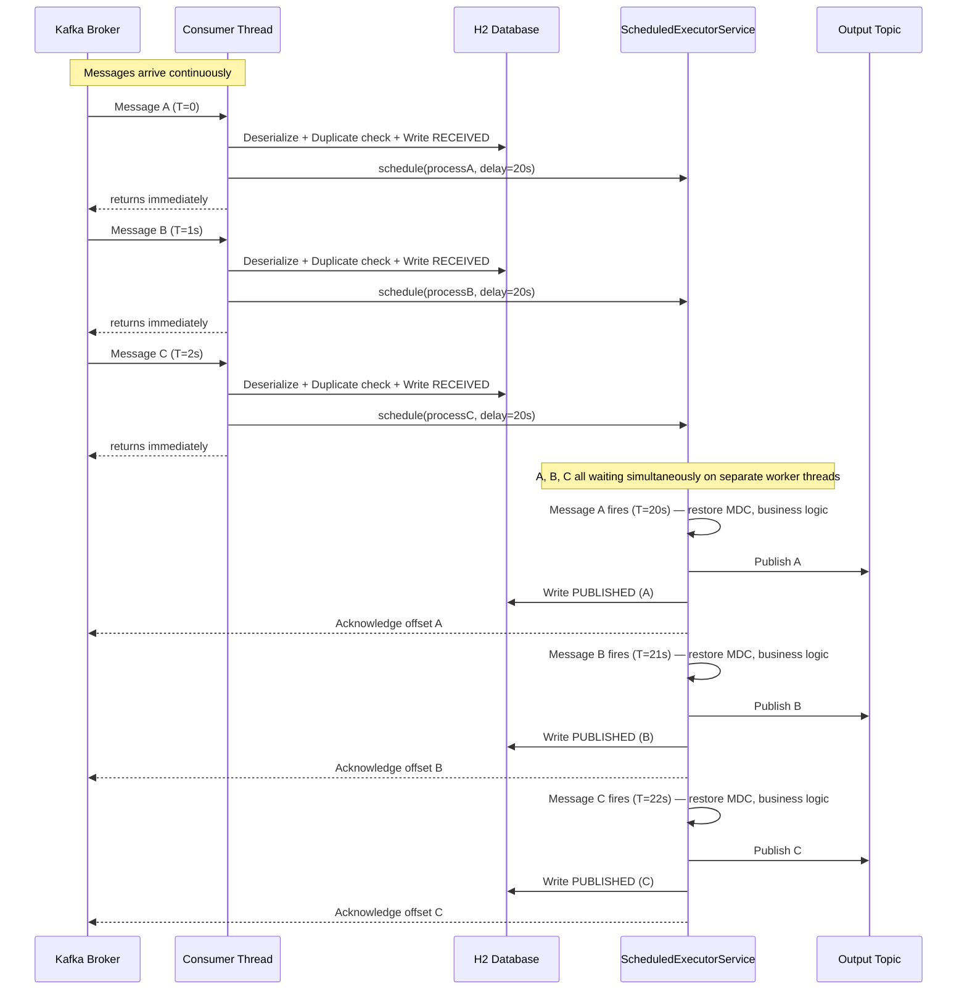

# Kafka Message Processor

A Spring Boot application that consumes messages from a Kafka input topic, applies a deliberate processing delay to account for upstream race conditions, and publishes the result to an output topic — with exactly-once semantics, atomic duplicate detection, structured logging, and a REST API for operational visibility.

---

## What It Does

1. **Consumes** JSON messages from a Kafka input topic using `read_committed` isolation (EOS consumer).
2. **Deserializes** each message into a typed `KafkaMessage` envelope (`event` header + `body` payload).
3. **Deduplicates** atomically — attempts to INSERT a `ReceivedRecord` with a unique constraint on `messageId`; a constraint violation means the message was already seen and it is immediately routed to the dead letter queue.
4. **Schedules** the remaining work on a `ScheduledExecutorService` with a configurable delay (default 20 seconds). The consumer thread returns immediately and is free to pull the next message — no blocking.
5. **Processes** the message via `MessageProcessorService` (business logic stub; swap in your own implementation).
6. **Publishes** the result to a Kafka output topic via a transactional producer.
7. **Acknowledges** the input offset only after the full pipeline succeeds.
8. Routes any failure to the **dead letter** store with a typed `reasonCode`.

---

## Architecture

### Component Overview

```
┌─────────────────────────────────────────────────────────────────────┐
│  Kafka Cluster                                                       │
│  ┌─────────────┐                         ┌─────────────────────┐   │
│  │ Input Topic │                         │   Output Topic      │   │
│  └──────┬──────┘                         └─────────────────────┘   │
└─────────┼───────────────────────────────────────────┬──────────────┘
          │                                           │ publish (transactional)
          ▼
┌─────────────────────────────────────────────────────────────────────┐
│  KafkaConsumerListener (consumer thread)                            │
│                                                                     │
│  1. Deserialize JSON → KafkaMessage                                 │
│  2. Set MDC (interactionId, messageId)                              │
│  3. ControlService.recordReceived()  ──► H2: INSERT received_record │
│       DataIntegrityViolationException? → DUPLICATE dead letter + ack│
│  4. Capture MDC snapshot                                            │
│  5. processingScheduler.schedule(delay=20s) → return immediately    │
└─────────────────────────────────────────────────────────────────────┘
          │ after delay fires
          ▼
┌─────────────────────────────────────────────────────────────────────┐
│  Worker Thread (ScheduledExecutorService)                           │
│                                                                     │
│  1. Restore MDC from snapshot                                       │
│  2. MessageProcessorService.process()   → PROCESSING_ERROR          │
│  3. KafkaProducerService.publish()      → PUBLISH_ERROR             │
│  4. ControlService.recordPublished()    → H2: INSERT published_record│
│  5. Acknowledgment.acknowledge()                                     │
└─────────────────────────────────────────────────────────────────────┘
          │ any failure at steps 2–4
          ▼
┌──────────────────────────┐
│  DeadLetterService       │
│  H2: dead_letter_record  │
│  (rawPayload, reasonCode,│
│   messageId, failedAt)   │
└──────────────────────────┘
```

### Concurrency Flow

Paste the diagram below into [mermaid.live](https://mermaid.live) to render it.



**Key points:**
- The **consumer thread is never blocked** — fast operations only (deserialize, duplicate check, write RECEIVED, schedule), then returns immediately
- **All messages are in-flight simultaneously**, each with their own independent 20-second countdown on a separate worker thread
- The **worker thread pool** is sized to the maximum expected in-flight messages: `msg/sec × delay-ms / 1000` (e.g., 12 msg/sec × 20s = 240 threads)
- **Acknowledgment happens on the worker thread** after the full pipeline completes — Kafka does not advance the offset until then
- If the app restarts mid-flight, un-acked messages are redelivered; the unique constraint on `ReceivedRecord.message_id` detects the duplicate INSERT and routes to dead letter safely

---

## Duplicate Detection

Duplicate detection is handled atomically via a **database unique constraint** on `received_record.message_id`:

- When a message arrives, the consumer thread attempts to `INSERT` a `ReceivedRecord` using `saveAndFlush()`.
- If the `messageId` has already been seen, the database fires a `DataIntegrityViolationException` — no separate `SELECT` query needed, no TOCTOU race condition.
- The consumer catches this exception, routes the message to the dead letter store with `DUPLICATE`, and acknowledges the offset.
- Messages still waiting out their 20-second delay are also protected — the constraint fires regardless of whether the first copy has finished processing.

**To replay a failed message:** delete its row from `received_record`, then replay the Kafka message. The INSERT will succeed and the message will process normally.

---

## Dead Letter Reason Codes

| Code | Trigger |
|------|---------|
| `DESERIALIZATION_ERROR` | Message payload is not valid JSON or does not match the expected schema |
| `DUPLICATE` | `messageId` already exists in `received_record` (unique constraint violation) |
| `CONTROL_RECORD_ERROR` | Unexpected failure writing the `ReceivedRecord` (not a constraint violation) |
| `PROCESSING_ERROR` | `MessageProcessorService.process()` threw an exception |
| `PUBLISH_ERROR` | `KafkaProducerService.publish()` threw an exception |

---

## REST API

All endpoints return JSON. Timestamps are ISO-8601. `startTimestamp` defaults to **now minus 12 hours** when omitted; `endTimestamp` is optional and open-ended when omitted.

### `GET /api/control/inbound`
Returns `ReceivedRecord` entries — messages that entered the processing pipeline.

| Parameter | Default | Description |
|-----------|---------|-------------|
| `startTimestamp` | now − 12h | Filter: `receivedAt >=` |
| `endTimestamp` | none | Filter: `receivedAt <=` |

Response fields: `messageId`, `interactionId`, `receivedAt`

### `GET /api/control/outbound`
Returns `PublishedRecord` entries — messages successfully published to the output topic.

| Parameter | Default | Description |
|-----------|---------|-------------|
| `startTimestamp` | now − 12h | Filter: `publishedAt >=` |
| `endTimestamp` | none | Filter: `publishedAt <=` |

Response fields: `messageId`, `interactionId`, `publishedAt`

> A `messageId` that appears in inbound but not outbound within a reasonable time window indicates a processing failure worth investigating.

### `GET /api/deadletter`
Returns dead letter entries — messages that failed at any stage.

| Parameter | Default | Description |
|-----------|---------|-------------|
| `startTimestamp` | now − 12h | Filter: `failedAt >=` |
| `endTimestamp` | none | Filter: `failedAt <=` |

Response fields: `messageId`, `interactionId`, `reasonCode`, `rawPayload`, `failedAt`

---

## Configuration

All settings are in `src/main/resources/application.yml`.

```yaml
app:
  processing:
    delay-ms: 20000       # ms to wait before processing each message (NOT a Kafka setting)
    worker-threads: 240   # thread pool size = msg/sec × delay-ms / 1000

kafka:
  bootstrap-servers: localhost:9092
  consumer:
    group-id: kafka-processor-group
    concurrency: 1        # threads per instance = partitions ÷ instances (10 ÷ 10 = 1)
  producer:
    transactional-id: kafkaprocessor-tx-1   # must be unique per instance
  topic:
    input: input-topic
    output: output-topic

server:
  port: 8080
```

**Sizing `worker-threads`:** multiply your expected messages/sec by your `delay-ms` in seconds. At 12 msg/sec with a 20-second delay, up to 240 messages can be simultaneously in-flight.

**Sizing `concurrency`:** set to `total partitions ÷ deployed instances`. With 10 partitions across 10 instances, `concurrency: 1` gives each instance exactly one partition. Setting it higher creates idle threads.

---

## Project Structure

```
src/main/java/com/example/kafkaprocessor/
├── KafkaProcessorApplication.java       # entry point
├── api/
│   ├── QueryController.java             # REST endpoints
│   └── TimeRangeHelper.java             # default timestamp resolution
├── control/
│   ├── ControlService.java              # interface
│   ├── ControlServiceImpl.java          # JPA implementation
│   ├── ReceivedRecord.java              # entity — unique constraint on messageId
│   ├── ReceivedRecordRepository.java
│   ├── PublishedRecord.java             # entity — no unique constraint
│   └── PublishedRecordRepository.java
├── deadletter/
│   ├── DeadLetterService.java           # interface
│   ├── DeadLetterServiceImpl.java       # JPA implementation
│   ├── DeadLetterRecord.java            # entity
│   ├── DeadLetterRepository.java
│   └── ReasonCode.java                  # enum
├── kafka/
│   ├── KafkaConsumerConfig.java         # consumer + scheduler beans
│   ├── KafkaConsumerListener.java       # @KafkaListener — main pipeline
│   ├── KafkaProducerConfig.java         # transactional producer bean
│   ├── KafkaProducerService.java        # publish wrapper
│   ├── KafkaPublishException.java
│   ├── MessageProcessorService.java     # business logic (stub — replace this)
│   └── ProcessingException.java
├── logging/
│   └── MdcContext.java                  # MDC set/clear helpers
└── model/
    ├── EventHeader.java                 # record — interactionId, eventType
    ├── KafkaMessage.java                # record — event + body envelope
    └── MessageBody.java                 # record — messageId

src/test/java/com/example/kafkaprocessor/
├── api/QueryControllerTest.java         # MVC slice test
├── control/ControlServiceImplTest.java  # JPA slice test
├── deadletter/DeadLetterServiceImplTest.java
├── integration/KafkaIntegrationTest.java # @EmbeddedKafka full test
└── kafka/KafkaConsumerListenerTest.java  # unit test
```

---

## Running Locally

Requires Java 21 and a running Kafka broker (or use the integration test with `@EmbeddedKafka`).

```bash
# Build and run all tests
gradle test

# Run the application
gradle bootRun
```

---

## Documentation

| File | Contents |
|------|----------|
| [requirements.md](requirements.md) | Full functional and non-functional requirements |
| [plan.md](plan.md) | Implementation phases and component breakdown |
| [tests.md](tests.md) | Description of every test and which requirement it covers |
| [concurrency-diagram.md](concurrency-diagram.md) | Mermaid sequence diagram of the scheduling model |
| [why.md](why.md) | Rationale for key architectural decisions |
