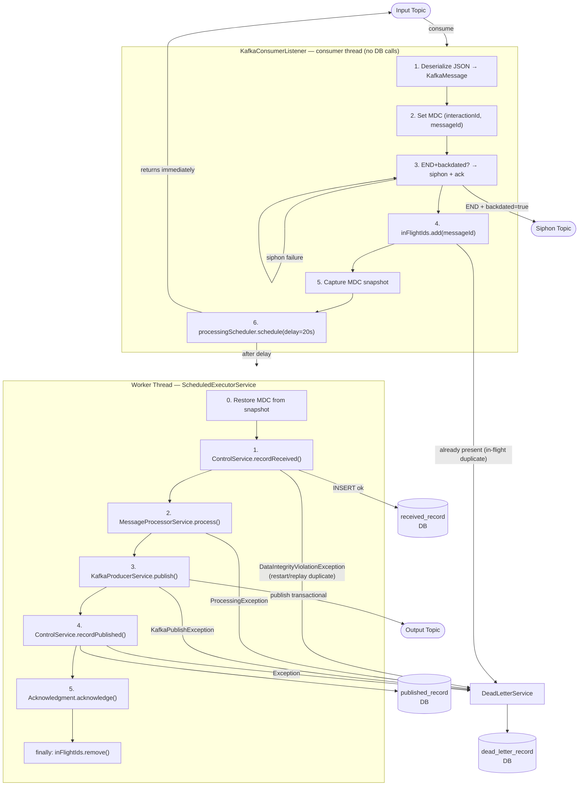
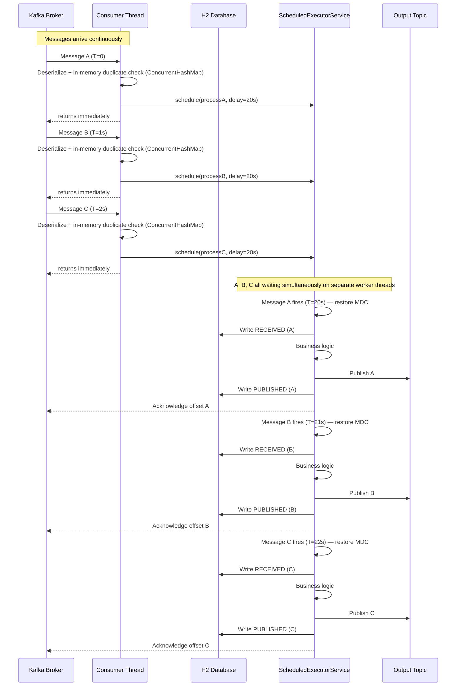

# Kafka Message Processor

A Spring Boot application that consumes messages from a Kafka input topic, applies a deliberate processing delay to account for upstream race conditions, and publishes the result to an output topic — with exactly-once semantics, atomic duplicate detection, structured logging, and a REST API for operational visibility.

---

## What It Does

1. **Consumes** JSON messages from a Kafka input topic using `read_committed` isolation (EOS consumer).
2. **Deserializes** each message into a typed `KafkaMessage` envelope (`event` header + `body` payload).
3. **Siphons** Backdated Endorsements (`eventType: END` + `backdated: true`) directly to a dedicated siphon topic and acks immediately — bypassing the delay, duplicate gate, and processing pipeline entirely.
4. **Deduplicates** atomically — uses an in-memory `ConcurrentHashMap` gate on the consumer thread; restart/replay duplicates are caught by a unique constraint on `ReceivedRecord.messageId` on the worker thread.
5. **Schedules** the remaining work on a `ScheduledExecutorService` with a configurable delay (default 20 seconds). The consumer thread returns immediately and is free to pull the next message — no blocking.
6. **Processes** the message via `MessageProcessorService` (business logic stub; swap in your own implementation).
7. **Publishes** the result to a Kafka output topic via a transactional producer.
8. **Acknowledges** the input offset only after the full pipeline succeeds.
9. Routes any failure to the **dead letter** store with a typed `reasonCode`.

---

## Event Types

| Code | Name | Notes |
|------|------|-------|
| `NC`  | New Business | Standard new policy intake |
| `END` | Endorsement | Policy modification. When `event.backdated: true`, this is a **Backdated Endorsement (BDE)** — siphoned directly to `kafka.topic.siphon-bde` on the consumer thread, bypassing the delay, duplicate gate, and processing pipeline. |
| `TRM` | Termination | Policy cancellation/termination |
| `RNW` | Renewal | Policy renewal |

Backdated Endorsements are identified at the field level (`eventType: END` + `backdated: true`) rather than by a distinct event type code. This keeps the routing table simple — `END` always means endorsement; the `backdated` flag drives the siphon fast-path.

---

## Architecture

### Component Overview



### Concurrency Flow



**Key points:**
- The **consumer thread makes zero DB calls** — fast operations only (deserialize, BDE siphon check, nanosecond in-memory duplicate check, schedule), then returns immediately

---

## Siphon Routing

The siphon system fast-paths selected messages directly to dedicated Kafka topics on the consumer thread, bypassing the 20-second delay, duplicate gate, and processing pipeline entirely.

### How it works

`KafkaConsumerListener` iterates a `List<SiphonEvaluator>` (first match wins). For each evaluator, `evaluate(message)` returns:
- `Optional.of(topicName)` — siphon to that topic and ack immediately, stopping evaluation
- `Optional.empty()` — continue to the next evaluator; if none match, the message follows the normal pipeline

Active evaluators are controlled by `app.siphon.enabled` (list of event codes). An empty list activates all registered evaluators.

### Naming convention

| Thing | Pattern | Example |
|-------|---------|--------|
| Evaluator class | `{EventCode}SiphonEvaluator` | `BdeSiphonEvaluator` |
| YAML property | `kafka.topic.siphon-{event-code}` | `kafka.topic.siphon-bde` |
| `@Value` annotation | `${kafka.topic.siphon-{event-code}}` | `${kafka.topic.siphon-bde}` |

### Implemented evaluators

| Class | Event code | Matches | Topic property |
|-------|-----------|---------|----------------|
| `BdeSiphonEvaluator` | `bde` | `eventType=END` + `backdated=true` | `kafka.topic.siphon-bde` |

Control which are active via `app.siphon.enabled` (empty = all active).

### Adding a new siphon route

1. Implement `SiphonEvaluator`, inject your topic via `@Value`, annotate with `@Component`:
   ```java
   @Component
   public class TrmSiphonEvaluator implements SiphonEvaluator {
       private final String topic;
       public TrmSiphonEvaluator(@Value("${kafka.topic.siphon-trm}") String topic) {
           this.topic = topic;
       }
       @Override
       public String eventCode() { return "trm"; }
       @Override
       public Optional<String> evaluate(KafkaMessage message) {
           if (message.event() == null) return Optional.empty();
           return EventType.TRM.equals(message.event().eventType())
               ? Optional.of(topic) : Optional.empty();
       }
   }
   ```

2. Add the topic key to `application.yml`:
   ```yaml
   kafka:
     topic:
       siphon-trm: trm-siphon-topic
   ```

3. Add the event code to `app.siphon.enabled`:
   ```yaml
   app:
     siphon:
       enabled: [bde, trm]
   ```
- **All messages are in-flight simultaneously**, each with their own independent 20-second countdown on a separate worker thread
- The **worker thread pool** is sized to the maximum expected in-flight messages: `msg/sec × delay-ms / 1000` (e.g., 12 msg/sec × 20s = 240 threads)
- **Acknowledgment happens on the worker thread** after the full pipeline completes — Kafka does not advance the offset until then
- If the app restarts mid-flight, un-acked messages are redelivered; the unique constraint on `ReceivedRecord.message_id` catches restart/replay duplicates on the worker thread

---

## Duplicate Detection

Duplicate detection uses two layers so the consumer thread never touches the database:

**Layer 1 — In-memory gate (consumer thread, nanosecond cost):**
- A `ConcurrentHashMap.newKeySet()` holds all `messageId`s currently in-flight.
- `add()` returns `false` if already present — the message is a duplicate within the 20-second delay window.
- Route to dead letter with `DUPLICATE` and ack immediately. No DB call, no round-trip.
- The set entry is removed in the worker's `finally` block (on success and on failure), so redelivered messages can re-enter the pipeline.

**Layer 2 — DB unique constraint (worker thread, restart/replay safety):**
- `ReceivedRecord` has a unique constraint on `message_id`.
- On app restart, the in-memory set is empty. When an un-acked message is redelivered, it passes Layer 1 but the DB constraint fires a `DataIntegrityViolationException` on the worker thread.
- Route to dead letter with `DUPLICATE` and ack.

**To replay a failed message:** delete its row from `received_record`, then replay the Kafka message. The INSERT will succeed and the message will process normally.

---

## Dead Letter Reason Codes

| Code | Trigger |
|------|---------|
| `DESERIALIZATION_ERROR` | Message payload is not valid JSON or does not match the expected schema |
| `DUPLICATE` | `messageId` already in the in-flight set (same-instance duplicate during delay window), or `DataIntegrityViolationException` from the DB unique constraint (restart/replay duplicate) |
| `CONTROL_RECORD_ERROR` | Unexpected failure writing the `ReceivedRecord` (not a constraint violation) |
| `PROCESSING_ERROR` | `MessageProcessorService.process()` threw an exception |
| `PUBLISH_ERROR` | `KafkaProducerService.publish()` threw an exception |

---

## REST API

All endpoints return JSON. Timestamps are ISO-8601. `startTimestamp` defaults to **now minus 12 hours** when omitted; `endTimestamp` is optional and open-ended when omitted.

### `GET /api/control/inbound`
Returns `ReceivedRecord` entries — messages that entered the processing pipeline.

| Parameter | Default | Description |
|-----------|---------|-------------|
| `startTimestamp` | now − 12h | Filter: `receivedAt >=` |
| `endTimestamp` | none | Filter: `receivedAt <=` |

Response fields: `messageId`, `interactionId`, `receivedAt`

### `GET /api/control/outbound`
Returns `PublishedRecord` entries — messages successfully published to the output topic.

| Parameter | Default | Description |
|-----------|---------|-------------|
| `startTimestamp` | now − 12h | Filter: `publishedAt >=` |
| `endTimestamp` | none | Filter: `publishedAt <=` |

Response fields: `messageId`, `interactionId`, `publishedAt`

> A `messageId` that appears in inbound but not outbound within a reasonable time window indicates a processing failure worth investigating.

### `GET /api/deadletter`
Returns dead letter entries — messages that failed at any stage.

| Parameter | Default | Description |
|-----------|---------|-------------|
| `startTimestamp` | now − 12h | Filter: `failedAt >=` |
| `endTimestamp` | none | Filter: `failedAt <=` |

Response fields: `messageId`, `interactionId`, `reasonCode`, `rawPayload`, `failedAt`

### `GET /api/config`
Returns the current running configuration as JSON.

Response fields: `kafka.bootstrapServers`, `kafka.consumerGroupId`, `kafka.consumerConcurrency`, `kafka.inputTopic`, `kafka.outputTopic`, `app.processingDelayMs`, `app.processingWorkerThreads`, `app.siphonEnabledEvaluators`

---

## Configuration

All settings are in `src/main/resources/application.yml`.

```yaml
app:
  processing:
    delay-ms: 20000       # ms to wait before processing each message (NOT a Kafka setting)
    worker-threads: 240   # thread pool size = msg/sec × delay-ms / 1000
  siphon:
    enabled: [bde]        # event codes of active SiphonEvaluators (empty = all active)

kafka:
  bootstrap-servers: localhost:9092
  consumer:
    group-id: kafka-processor-group
    concurrency: 1        # threads per instance = partitions ÷ instances (10 ÷ 10 = 1)
  producer:
    transactional-id: kafkaprocessor-tx-1   # must be unique per instance
  topic:
    input: input-topic
    output: output-topic
    siphon-bde: siphon-bde-topic    # BdeSiphonEvaluator — Backdated Endorsements (END + backdated=true)
    # siphon-trm: trm-topic         # example: add TrmSiphonEvaluator for TRM events

server:
  port: 8080
```

**Sizing `worker-threads`:** multiply your expected messages/sec by your `delay-ms` in seconds. At 12 msg/sec with a 20-second delay, up to 240 messages can be simultaneously in-flight.

**Sizing `concurrency`:** set to `total partitions ÷ deployed instances`. With 10 partitions across 10 instances, `concurrency: 1` gives each instance exactly one partition. Setting it higher creates idle threads.

---

## Project Structure

```
src/main/java/com/example/kafkaprocessor/
├── KafkaProcessorApplication.java       # entry point
├── api/
│   ├── ConfigController.java            # GET /api/config — configuration view
│   ├── QueryController.java             # REST query endpoints
│   └── TimeRangeHelper.java             # default timestamp resolution
├── config/
│   └── AppProperties.java               # @ConfigurationProperties for app.*
├── control/
│   ├── ControlService.java              # interface
│   ├── ControlServiceImpl.java          # JPA implementation
│   ├── ReceivedRecord.java              # entity — unique constraint on messageId
│   ├── ReceivedRecordRepository.java
│   ├── PublishedRecord.java             # entity — no unique constraint
│   └── PublishedRecordRepository.java
├── deadletter/
│   ├── DeadLetterService.java           # interface
│   ├── DeadLetterServiceImpl.java       # JPA implementation
│   ├── DeadLetterRecord.java            # entity
│   ├── DeadLetterRepository.java
│   └── ReasonCode.java                  # enum
├── kafka/
│   ├── KafkaConsumerConfig.java         # consumer + scheduler + active evaluator beans
│   ├── KafkaConsumerListener.java       # @KafkaListener — main pipeline
│   ├── KafkaProducerConfig.java         # transactional producer bean
│   ├── KafkaProducerService.java        # publish wrapper
│   ├── KafkaPublishException.java
│   ├── MessageProcessorService.java     # business logic (stub — replace this)
│   ├── ProcessingException.java
│   └── siphon/
│       ├── SiphonEvaluator.java         # interface — eventCode() + evaluate()
│       └── BdeSiphonEvaluator.java      # routes END+backdated=true to siphon-bde topic
├── logging/
│   └── MdcContext.java                  # MDC set/clear helpers
└── model/
    ├── EventHeader.java                 # record — interactionId, eventType
    ├── KafkaMessage.java                # record — event + body envelope
    └── MessageBody.java                 # record — messageId

src/test/java/com/example/kafkaprocessor/
├── api/
│   ├── ConfigControllerTest.java        # MVC slice test
│   └── QueryControllerTest.java         # MVC slice test
├── control/ControlServiceImplTest.java  # JPA slice test
├── deadletter/DeadLetterServiceImplTest.java
├── integration/KafkaIntegrationTest.java # @EmbeddedKafka full test
└── kafka/
    ├── KafkaConsumerListenerTest.java    # unit test
    └── siphon/
        └── BdeSiphonEvaluatorTest.java   # unit test
```

---

## Running Locally

Requires Java 21 and a running Kafka broker (or use the integration test with `@EmbeddedKafka`).

```bash
# Build and run all tests
gradle test

# Run the application
gradle bootRun
```

---

## Documentation

| File | Contents |
|------|----------|
| [requirements.md](requirements.md) | Full functional and non-functional requirements |
| [plan.md](plan.md) | Implementation phases and component breakdown |
| [tests.md](tests.md) | Description of every test and which requirement it covers |
| [concurrency-diagram.md](concurrency-diagram.md) | Mermaid sequence diagram of the scheduling model |
| [why.md](why.md) | Rationale for key architectural decisions |
