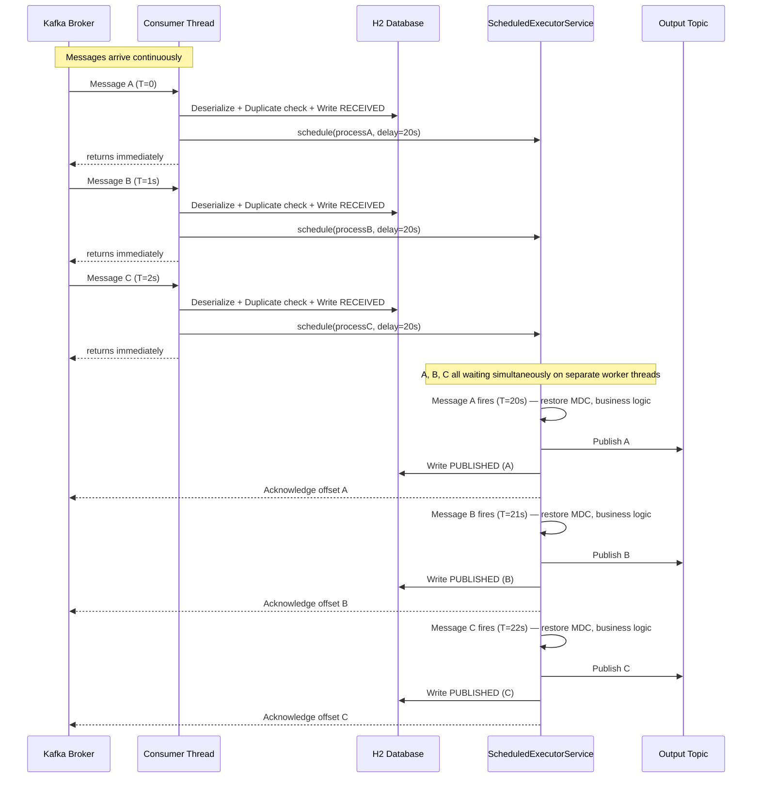

# Message Processing Concurrency Flow

Paste the diagram below into [mermaid.live](https://mermaid.live) to render it.

## Key Points

- The **consumer thread is never blocked** — fast operations only (deserialize, duplicate check, write RECEIVED, schedule), then returns immediately
- **All messages are in-flight simultaneously**, each with their own independent 20-second countdown on a separate worker thread
- The **worker thread pool** is sized to the maximum expected in-flight messages: `msg/sec × delay-ms / 1000` (e.g., 12 msg/sec × 20s = 240 threads)
- **Acknowledgment happens on the worker thread** after the full pipeline completes — Kafka does not advance the offset until then
- If the app restarts mid-flight, un-acked messages are redelivered; the unique constraint on `ReceivedRecord.message_id` detects the duplicate INSERT and routes to dead letter safely
